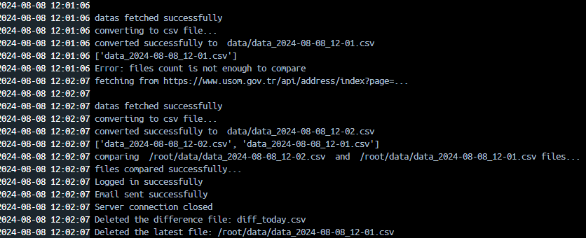
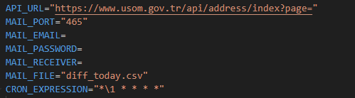

# USOM Malicious Links Tracker

This project automates fetching data from the USOM (National Cyber Security Incident Response Center) API, comparing it with previous data, and sending email notifications with the differences. It uses Python for data processing, CSV conversion, and email handling. The application runs inside a Docker container, with a flexible scheduling mechanism controlled by environment variables.

## Features

- **Automated Data Fetching**: Retrieves data from the USOM API at scheduled intervals.
- **Data Comparison**: Compares newly fetched data with previously stored data.
- **Email Notifications**: Sends email notifications with the differences in data.
- **Dockerized Environment**: Runs in a Docker container for consistent and isolated execution.

## Prerequisites

- Docker
- Python 3.11

## Setup

1. **Clone the repository**:
    ```sh
    git clone https://github.com/RamazanAkdag/USOM-malicious-links-tracker.git
    cd USOM-malicious-links-tracker
    ```

2. **Create a `.env` file** in the project root with the following content:
    ```env
    API_URL=https://www.usom.gov.tr/api/address/index?page=
    MAIL_PORT=465
    MAIL_EMAIL=your_email@gmail.com
    MAIL_PASSWORD="your_password"
    MAIL_RECEIVER=receiver_email@example.com
    MAIL_FILE=diff_today.csv
    CRON_EXPRESSION="0 12 * * *"
    ```

3. **Build the Docker image**:
    ```sh
    docker build -t usom-mailer .
    ```

4. **Run the Docker container from docker hub**:
    ```sh
    docker run -d -v path\of_the\env\.env:/env/.env ramazanakdag/usom-mailer
    ```

## Screenshots



## License

This project is licensed under the MIT License. See the [LICENSE](LICENSE) file for details.
